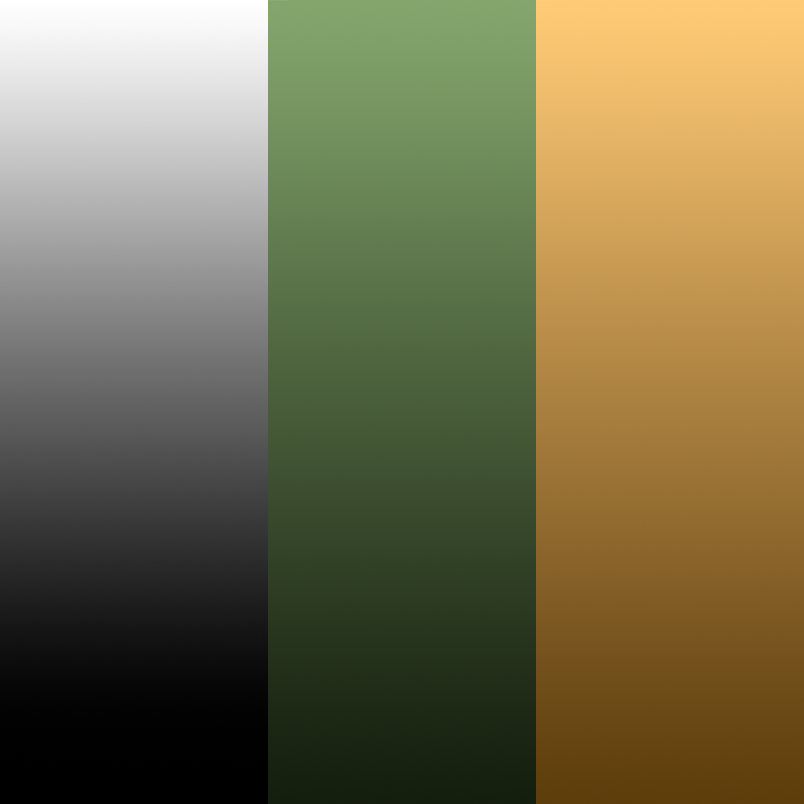

# The Tank

Welcome to Week 5! This week we're moving away from fantasy weapons and into vehicles, starting with a low poly tank.

We will build the tank out of three simple pieces: a hull, a turret, and a barrel, all shaped from a cube and a couple of cylinders.

.png>)

## Modeling The Tank

To block out the tank we will use 3 basic shapes:

* Cube (the hull)
* Cylinder (the turret)
* Cylinder (the barrel)

### The Hull

With Blender open, you'll have the default cube in your scene. This will become the hull of the tank.

.png>)

Enter edit mode with ++tab++ and select all with ++a++.

.png>)

We need to flatten the cube down into a low, wide slab. Press ++s++ then ++z++ to lock the scale to the Z-axis, and type `0.5` to squash it down.

.png>)

Back in object mode, you should have a flat block to work with.

.png>)

Now for the armoured look of the hull. Press ++ctrl++ + ++b++ to **Bevel** the whole shape, and drag out a bevel before confirming. In the popup window on the bottom left, set the Width to `0.3m`.

!!! Note
    Bevelling every edge of a box like this rounds off all the corners at once, turning a plain cube into a faceted, angular shape - a great low poly trick for armour plating.

.png>)

Switch to edge select (++2++) and use **Loop Select** to select the loop running around the top of the hull, using the Delimit dropdown in the popup window to select by **Outer Corners**.

.png>)

Bevel this loop again (++ctrl++ + ++b++), this time with a smaller Width of `0.25m`. This adds an extra facet just below the top face, giving the hull more of a layered, armoured silhouette.

.png>)

Add a single loop cut running down the length of the hull with the Loop Cut tool, this will give us the geometry we need to shape the front of the tank into a sloped nose.

.png>)

Switch to a side orthographic view and, with **X-Ray** toggled on, box select the lower front portion of the hull, this is the section that will become the sloped glacis plate at the front of the tank.

.png>)

With those faces selected, press ++e++ to **Extrude** and drag outward to pull the nose of the hull forward.

.png>)

Scale the newly extruded face down slightly on the X and Y axes (++s++, then type `0.9`) to taper it in, giving the nose a wedge shape rather than a flat slab.

.png>)

Back in object mode, you should now have a hull with a sloped, angular nose.

.png>)

Double click the object in the outliner and rename it "Tracks".

### The Turret

In object mode, add a Cylinder (++"add"++ > Mesh > Cylinder). In the popup window on the bottom left, set Vertices to `8`, Radius to `0.65m` and Depth to `0.5m`, then move it up so it sits on top of the hull.

.png>)

Select the cylinder and enter edit mode with ++tab++.

.png>)

Using **Loop Select**, select the top edge loop of the turret, setting the Delimit option to **Outer Corners** in the popup window.

.png>)

Bevel this loop (++ctrl++ + ++b++) with a Width of `0.2m` to soften the top rim of the turret and give it a bit more shape.

.png>)

You should now have a faceted octagonal turret sitting neatly on the hull.

.png>)

Finally, rotate the turret ++"r"++ ++"z"++ `22.5` degrees around the Z-axis, offsetting its facets from the hull's for a bit more visual interest.

### The Barrel

Still in edit mode on the turret, use ++"add"++ > Mesh > Cylinder again.

!!! Note
    Because we're already in edit mode, this adds the new cylinder's geometry directly into the turret's mesh, rather than creating a brand new object. This keeps the turret and the barrel as one single object from the start.

In the popup window, set Vertices to `8`, Radius to `0.1m` and Depth to `0.75m`, then set Rotation X to `90°` so it points sideways, and move it out along the Y-axis so it pokes out the front of the turret like a barrel.

With the outer end of the barrel selected, press ++e++ to **Extrude** and then ++z++ to move it further out, lengthening the barrel.

Scale this end face up slightly on the X and Z axes (`1.5`) to flare it out into a muzzle.

.png>)

Select the outer edge loop of the muzzle with **Loop Select** (Delimit: Outer Corners).

.png>)

Bevel this loop (++ctrl++ + ++b++) with a small Width of around `0.02m` to soften the tip of the muzzle.

.png>)

Back in object mode, rename this object "Turret". You should now have a hull and a turret with a barrel, though the barrel is currently just poking straight through the front face of the turret.

.png>)

### Joining It All Together

Since the barrel was built as an extrusion poking out through the turret's front face, there's still a solid wall of turret geometry sitting inside the barrel where the two overlap. We need to open a hole for the barrel to pass through cleanly.

Enter edit mode on the turret and select the faces on the front of the turret that overlap with the base of the barrel.

.png>)

Press ++x++ and choose **Faces** to delete just these faces, leaving a hole for the barrel to sit in.

.png>)

You should now be able to see through the front of the turret and into the hollow barrel.

.png>)

!!! Note
    Holding ++z++ and hovering over "Wireframe" lets you see through the mesh, just like we did for the hammer and sword. This is useful here for checking that the hole lines up properly with the barrel.

To make sure the edges around the hole and the base of the barrel line up exactly, turn on **Snapping** from the magnet icon in the header, and set the Snap Target to **Vertex**.

.png>)

With snapping enabled, select the edge loop around the base of the barrel and nudge it with ++g++ so its vertices snap onto the edges of the hole we just cut. Once everything lines up, select edges around the gap a few at a time and press ++f++ to fill in the faces, just like we did to join the hammer's head to its handle.

.png>)

Take a moment in wireframe view to check over the junction between the barrel and the turret, cleaning up any stray vertices or overlapping faces you find.

Once everything is sealed up neatly, jump back to object mode and take a look at your finished tank!

.png>)

Congratulations! You have successfully modeled the tank!

## Unwrapping The Tank

Now that both the hull and the turret are modeled, it's time to lay out their UVs so we can paint them with colour.

Switch to the "UV Editing" workspace in the top ribbon, just like we did for the hammer and sword.

Select the turret and enter edit mode. We'll start with the barrel - select the edge loop where it meets the front of the turret, and the loop around the tip of the muzzle, then right click and choose **Mark Seam** for each.

.png>)

.png>)

With those seams marked, select all faces with ++a++, open the UV menu, and choose **Unwrap**. The barrel unfolds into a long, clean strip separate from the rest of the turret.

.png>)

Next, mark a seam around the top rim of the turret and around the beveled edge just below it, isolating the top face and the hatch detail from the sides.

.png>)

Unwrap again, and you should end up with a set of neat islands for the turret's top, sides, hatch, and the barrel.

.png>)

Now select the hull and enter edit mode. Mark a seam around the top edge loop, separating the sloped top plates from the lower sides of the hull.

.png>)

Select all with ++a++ and Unwrap. You'll end up with a clean layout for the hull to match the turret.

.png>)

With both objects unwrapped, select them both in the outliner and take a look at the combined UV layout - you should have a tidy set of islands ready for texturing.

.png>)

Congratulations! You have unwrapped the tank!

## Material Setup

Just as we did with the hammer, we will use a colour palette texture to shade the tank.

[Download the tank colour palette here (PNG)](../textures/Tanks_CP_Green.png){download="Tanks_CP_Green.png"}

Switch to the "Shading" workspace with the turret selected.

Navigate to where you downloaded the colour palette and select it in the file browser to load it into the image viewer.

.png>)

From "Base Color" on the Principled BSDF node, click and drag out, type "Image" and press ++enter++ to create an Image Texture node, then choose your colour palette from the image drop down.

.png>)

.png>)

Back in the Layout workspace, at the top right drop down under "Object" navigate to "Texture" so you can see the material in the viewport.

.png>)

Now select the hull ("Tracks"). Rather than creating a brand new material, click the browse icon next to the material name box in the Material Properties tab and select the material you just created for the turret.

.png>)

!!! Note
    Just like linking the hammer's material to the sword, this reuses the same colour palette on both objects, so the whole tank pulls its colours from a single image.

Both the hull and the turret should now be shaded with the colour palette, ready for texturing.

.png>)

## Texturing the Tank

Jump into the UV Editing workspace with the turret selected. You'll see the barrel, top, sides, and hatch shells sitting in the UV layout, all bunched up on top of the palette image.

.png>)

To make things easier to work with, switch the 3D viewport's shading to **Material Preview** so you can see the colours update in real time as you move shells around.

.png>)

Let's start with the main body of the turret. Select its shell and move it (++g++) onto the green square of the palette, scaling it down first with ++s++ if you want more of the colour gradient to show.

.png>)

Do the same for the hull's shells, moving them onto the same green square so the whole body of the tank matches.

.png>)

Select the barrel's shell and move it onto the gold/brown square instead, giving the metal barrel a different tone from the armour plating.

.png>)

Move on to the smaller detail shells - the hatch on top of the turret and the muzzle end of the barrel. Select each one and move it onto the grey square at the far end of the palette for a metallic look.

.png>)

Keep working through each remaining shell, scaling and moving them onto whichever colour you'd like that part of the tank to be.

.png>)

.png>)

Once every shell has a colour, jump back to object mode to see your finished, fully textured tank!

.png>)

Congratulations! You have successfully textured the tank!
